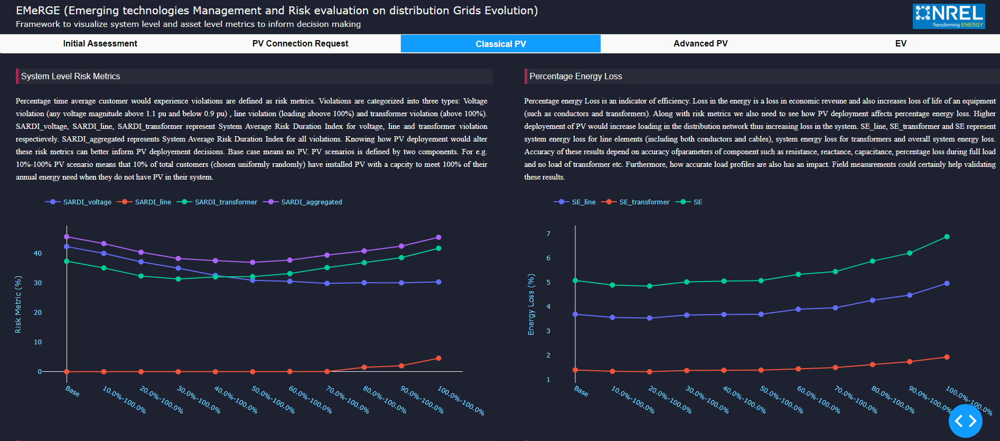

EMeRGE 
===================================================================================================

EMeRGE (Emerging technologies Management and Risk evaluation on distribution Grids Evolution) is a collection of mini-tools to help users develop openDSS feeder model from GIS (.shp) file and perform risk analysis at various PV scenarios and visualize results in an interactive dashboard made using Dash.

## Releases 

